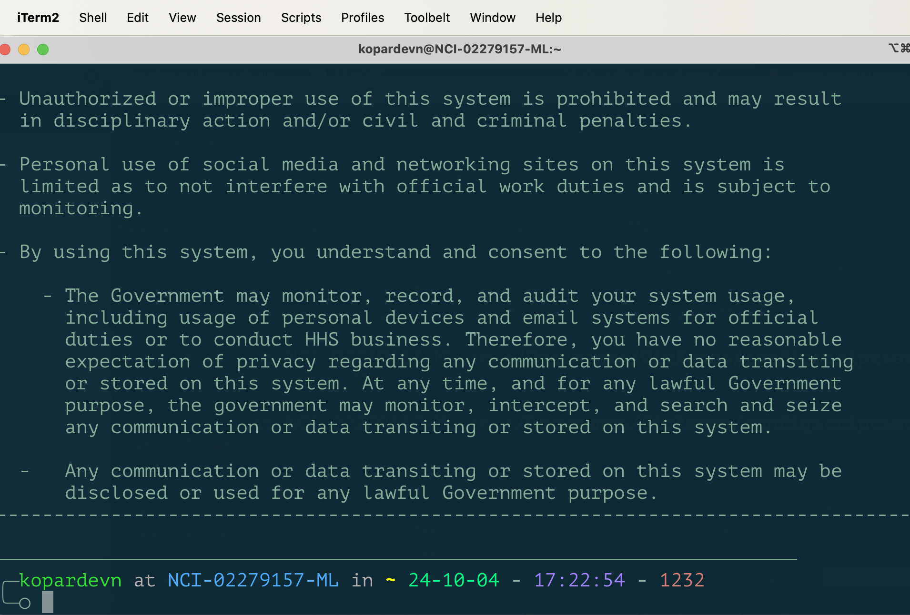

<!-- vscode-markdown-toc -->
- [1. Generate ssh keys and setup biowulf](#1-generate-ssh-keys-and-setup-biowulf)
- [2. Setup GitHub](#2-setup-github)
- [3. Setup iTerm2](#3-setup-iterm2)
- [4. Setup zsh](#4-setup-zsh)
- [4. Install brew and zsh plugins](#4-install-brew-and-zsh-plugins)
- [5. Install VSCode](#5-install-vscode)
	- [5.1 Add `code` to PATH](#51-add-code-to-path)
	- [5.2 Add vscode extensions](#52-add-vscode-extensions)
- [6. Install Java](#6-install-java)
- [7. Setup cronjobs](#7-setup-cronjobs)
- [8. Setup conda environments](#8-setup-conda-environments)
	- [8.1 Install miniconda](#81-install-miniconda)
	- [8.2 Copy conda envs](#82-copy-conda-envs)
- [8. Install Other tools](#8-install-other-tools)
- [9. Install other brew tools](#9-install-other-brew-tools)
- [10. Restore old files](#10-restore-old-files)

<!-- vscode-markdown-toc-config
	numbering=true
	autoSave=true
	/vscode-markdown-toc-config -->
<!-- /vscode-markdown-toc -->


###  1. <a name='Generatesshkeysandsetupbiowulf'></a>Generate ssh keys and setup biowulf

```bash
ssh-keygen -t rsa -b 4096
```

Copy the contents of `id_rsa.pub` file and append to `.ssh/authorized_keys` on biowulf

###  2. <a name='SetupGitHub'></a>Setup GitHub

```bash
git config -l
git config --global user.name "kopardev"
git config --global user.email "vishal.koparde@nih.gov"
git config --global credential.helper cache
git config --global core.fileMode false
```

Next time GH asks for password, copy paste the PAT and it will not ask password until PAT expires. More details [here](https://github.com/CCBR/Tools/tree/master/git#pat-or-personal-access-token).

Copy contents of `id_rsa.pub` from the previous step and setup ssh access to github.com [here](https://github.com/settings/keys). Verify access by running:

```bash
ssh -T git@github.com
```

###  3. <a name='Setupiterm'></a>Setup iTerm2

After downloading and installing iTerm2, import the `kopardevn_iterm_theme.json` using Settings > Profiles > Import JSON profiles

This will restore the look-and-feel of iTerm2:



###  4. <a name='Setupzsh'></a>Setup zsh


```bash
#!/bin/bash
# MAC OSX defaults to zsh now from bash

# set zsh as default shell
chsh -s $(which zsh)

# install oh-my-zsh
if [ -f ~/.zshrc ]; then
mv ~/.zshrc ~/.zshrc.original
fi
sh -c "$(curl -fsSL https://raw.githubusercontent.com/ohmyzsh/ohmyzsh/master/tools/install.sh)"

brew install zsh-completions
git clone https://github.com/bhilburn/powerlevel9k.git ~/.oh-my-zsh/custom/themes/powerlevel9k

# add "source ~/.zshrc_kopardevn" to the bottom of ~/.zshrc file
echo "source ~/.zshrc_kopardevn" >> ~/.zshrc

# Now add customizations to ~/.zshrc_kopardevn
```

Set the theme in `~/.zshrc`

```bash
# copy theme file to the correct location
cp fino-time-plus.zsh-theme ~/.oh-my-zsh/custom/themes/
# now add this to the ~/.zshrc
ZSH_THEME="fino-time-plus"
```


###  4. <a name='InstallBrew'></a>Install brew and zsh plugins


```bash
# install brew
/bin/bash -c "$(curl -fsSL https://raw.githubusercontent.com/Homebrew/install/HEAD/install.sh)"

# install zsh-interactive-cd plugin
brew install fzf
# add the following line to ~/.zshrc
source <(fzf --zsh)
# install the plugin
brew tap mrzool/zsh-interactive-cd
brew install zsh-interactive-cd

# Install tmux, git
brew install tmux
brew install git

# for vscode plugin 
# follow instructions on https://github.com/valentinocossar/vscode
git clone https://github.com/valentinocossar/vscode.git ${ZSH_CUSTOM}/plugins/vscode

# Install per-directory-history
git clone https://github.com/zsh-users/zsh-history-substring-search ${ZSH_CUSTOM}/plugins/zsh-history-substring-search
git clone https://github.com/jimhester/per-directory-history.git ${ZSH_CUSTOM}/plugins/per-directory-history
# add these to ~/.zshrc
source ${ZSH_CUSTOM}/plugins/per-directory-history/per-directory-history.zsh
bindkey '\e[A' directory-history-search-backward
bindkey '\e[B' directory-history-search-forward
bindkey '^j' history-substring-search-up
bindkey '^k' history-substring-search-down
HISTORY_BASE="/Users/${USER}/per-directory-history"
```

> Note (UPDATE): Typora is no longer free to use. You may have to use a VSCode plugin to edit `.md` files and to upload images embedded in them.

###  5. <a name='InstallVSCode'></a>Install VSCode

Download and install from [here](https://code.visualstudio.com/download). Then install the following extensions

#### 5.1 Add `code` to PATH
- Open Visual Studio Code.
- Press Ctrl + Shift + P (or Cmd + Shift + P on macOS) to open the Command Palette.
- Type and select Shell Command: Install 'code' command in PATH.

#### 5.2 Add vscode extensions

```bash
./install_vscode_extensions.sh
```

###  6. <a name='InstallJava'></a>Install Java

```bash
ruby -e "$(curl -fsSL https://raw.githubusercontent.com/Homebrew/install/master/install)"
brew tap homebrew/cask-versions
brew update
brew tap homebrew/cask
brew install java
```

```bash
sudo ln -sfn /opt/homebrew/opt/openjdk/libexec/openjdk.jdk /Library/Java/JavaVirtualMachines/openjdk.jdk
# add these to ~/.zshrc_kopardevn
export PATH="/opt/homebrew/opt/openjdk/bin:$PATH"
export CPPFLAGS="-I/opt/homebrew/opt/openjdk/include"
```

###  7. <a name='cronjobs'></a>Setup cronjobs

### 8. <a name='setupconda'></a>Setup conda environments

#### 8.1 Install miniconda

```bash
brew update
brew install --cask miniconda
# conda init zsh
conda init "$(basename "${SHELL}")"
# restart the terminal
# update everything
conda update conda -y
conda update --all -y
```

#### 8.2 Copy conda envs

- Run `backup_conda_envs.sh` on the old laptop to create a backup folder `conda-env-backup` with exported yml files (1 file per env)
- Move the folder to the new laptop
- Run `install_conda_envs.sh` to install the conda envs from the yml files

###  8. <a name='InstallOthertools'></a>Install Other tools

[XQuartz](https://www.xquartz.org/) This is required for `ssh -Y` to work correctly. Installation requires restart. Verify installation with `echo $DISPLAY`.
[Evernote](https://evernote.com/download)
[Google Chrome](https://www.google.com/chrome/) Then sign in with google account to auto install extensions and download bookmarks.
[Brave Browser](https://brave.com/download/#mac-options) Then import bookmarks from Google Chrome.
[IGV](https://software.broadinstitute.org/software/igv/download)
[R](https://cran.r-project.org/bin/macosx/)
[Rstudio](https://www.rstudio.com/products/rstudio/download/)
[Adobe Reader](https://get.adobe.com/reader/) This is required for Digitally signing PDFs with PIV card certificates.

###  9. <a name='Installotherbrewtools'></a>Install other brew tools

```bash
brew install wget
brew install tree
brew install terminal-notifier
brew install coreutils
brew install gh
pip3 install --user --upgrade pip && pip install --user mkdocs && pip install --user mkdocs-material
```

###  10. <a name='Restoreoldfiles'></a>Restore old files

1. Files are backed up to external HDD and can be recovered via rsync
2. Files can be restored using Druva InSync (recommended)
